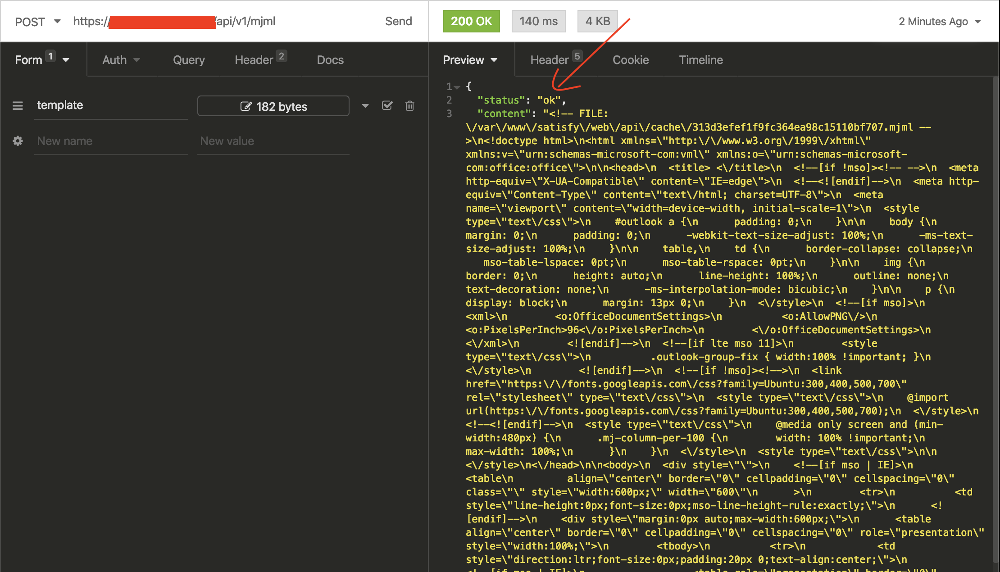

MJML PHP server
===============


Imagine you want render your [MJML template](https://mjml.io) on your private PHP server, now you can.

How to install
--------------

Install this package by [Composer](https://getcomposer.org) or download manually:

```shell
composer require baraja-core/mjml-php-server
```

Your server must use `PHP 7.1` or better and installed MJML by Node modules (internal command is `/node_modules/.bin/mjml`).

Server configuration
--------------------

Your server must support the [shell_exec()](https://www.php.net/manual/en/function.shell-exec.php) function and Apache or Ngnix.

In your root directory of webserver please configure calling this internal logic. For instance this way (most simply solution):

```php
<?php

require __DIR__ . '/src/MjmlServer.php'; // Path to this package

$cacheDir = __DIR__ . '/cache'; // Or can be null

(new \Baraja\Mjml\MjmlServer($cacheDir))->run();
```

Now your MJML server is configured.

When you call URI `/api/v1/mjml` by HTTP request on your domain, you can render your MJML template.

API usage
---------

API must be called by POST method with body parameter `template` with template.

Final template will be returned by json response.

Some example:

Call URI `/api/v1/mjml` with parameter:



Minimal template configuration:

```html
<mjml>
    <mj-body>
        <mj-section>
            <mj-column>
                <mj-text>Hello World</mj-text>
            </mj-column>
        </mj-section>
    </mj-body>
</mjml>
```